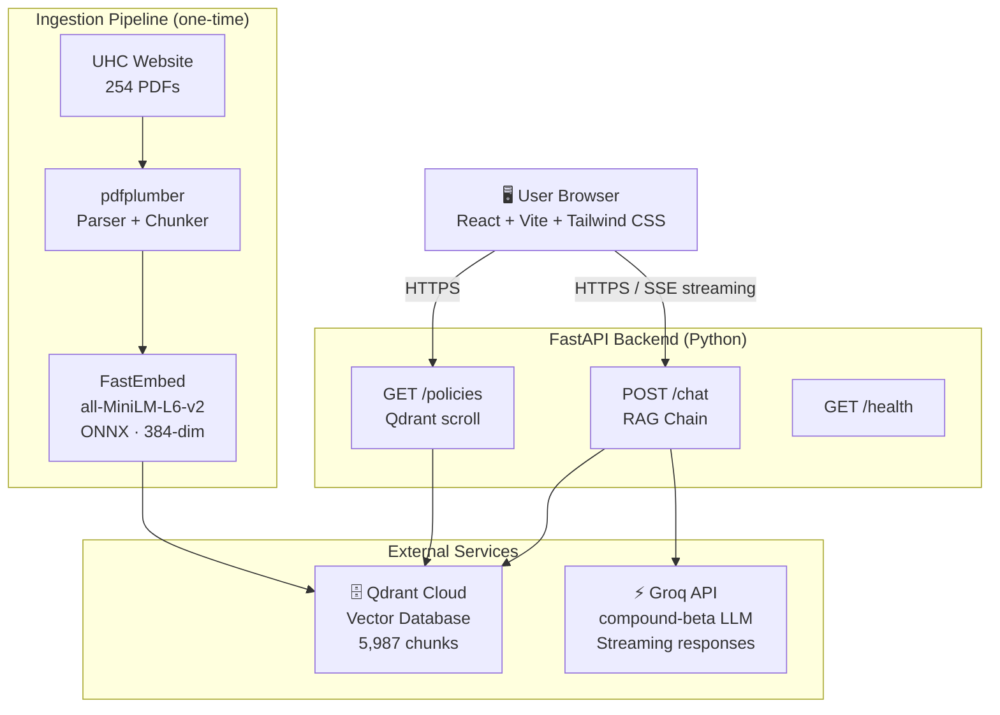
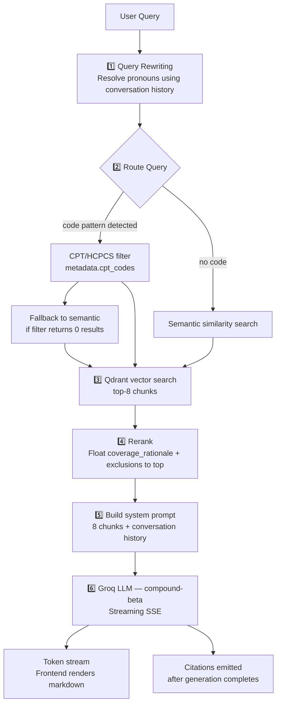

# CombinedHealth — Policy Intelligence Platform

An AI-powered chatbot for querying UnitedHealthcare commercial medical and drug policies. Built for healthcare providers — doctors, nurses, and billing staff — to get instant, cited answers from 254 UHC policies.

---

## Live Demo

> **Hosted URL:** _https://insurer-policy-chatbot.vercel.app/_
Note: The backend is hosted on Render and the frontend is hosted on Vercel. The first request might take 2-3 minutes to load as the backend is in sleep mode.

---

## How to Use the Chatbot

### Step 1 — Open the app

Navigate to the hosted URL in any browser. You will see a two-panel interface:
- **Left panel:** Policy Library — browse and search all 254 indexed UHC policies
- **Right panel:** Chat window

### Step 2 — Ask a question

Type a question in the input box at the bottom of the chat panel. Press **Enter** to send or **Shift+Enter** for a new line.

**Example questions:**
- `Is bariatric surgery covered for BMI over 35?`
- `What are the prior auth requirements for MRI?`
- `What does CPT code 43644 cover?`
- `What are the coverage criteria for Xolair omalizumab?`
- `When is genetic testing for cardiac disease covered?`
- `What are the exclusions for negative pressure wound therapy?`

You can also click any of the **suggested questions** shown on the empty chat screen.

### Step 3 — Read the response

The assistant streams its answer in real time. Responses are formatted in Markdown with:
- **COVERED WHEN:** — bullet list of coverage criteria
- **NOT COVERED WHEN:** — exclusions and non-coverage conditions
- `CPT codes` highlighted inline
- Policy name and effective date cited

### Step 4 — Review citations

Below each assistant response, citation cards appear showing:
- Policy name and section (e.g. *Coverage Rationale*)
- Effective date
- Link to the original PDF on uhcprovider.com

### Step 5 — Browse the Policy Library

Use the left sidebar to:
- **Search** policies by name
- **Filter** by All / Medical / Drug
- **Click** any policy to automatically ask about it in the chat

### Step 6 — Follow-up questions

The assistant maintains conversation history for your session (last 4 turns). You can ask follow-up questions naturally:
> "Tell me about bariatric surgery coverage"
> "What CPT codes are associated with it?"

---

## Architecture

### High-Level Design (HLD)



### Data Flow per User Query



---

### Low-Level Design (LLD)

#### Backend (`backend/`)

```
backend/
├── app/
│   ├── config.py               # Env vars, provider registry, model settings
│   ├── main.py                 # FastAPI app, CORS, rate limiting, lifespan warmup
│   ├── core/
│   │   ├── embeddings.py       # Cached FastEmbed MiniLM embeddings singleton (ONNX, no PyTorch)
│   │   ├── retriever.py        # Qdrant search: CPT filter + semantic + reranker
│   │   ├── rag_chain.py        # RAG pipeline: query rewrite → retrieve → LLM stream
│   │   ├── memory.py           # TTLCache session store (30-min TTL, 4-turn window)
│   │   └── provider_base.py    # PolicyChunk dataclass + abstract PolicyProvider
│   ├── routes/
│   │   ├── chat.py             # POST /chat — SSE streaming endpoint
│   │   ├── policies.py         # GET /policies — lists all indexed policies
│   │   └── health.py           # GET /health — Qdrant + model connectivity check
│   └── providers/
│       └── uhc/
│           ├── scraper.py      # Scrapes UHC provider site for PDF URLs (cached)
│           ├── downloader.py   # Downloads PDFs with retry logic
│           ├── parser.py       # pdfplumber: extracts sections, policy name, dates
│           ├── metadata.py     # Regex extractor for CPT, HCPCS, ICD-10 codes
│           └── chunker.py      # Token-aware sentence chunking (800 tok, 100 overlap)
└── ingestion/
    ├── run_ingestion.py        # CLI: scrape → download → parse → chunk → embed → upsert
    └── push_to_qdrant.py       # Batch upsert to Qdrant with collection + index creation
```

#### Key Backend Components

**`retriever.py` — Hybrid Retrieval**
- Detects CPT/HCPCS codes (`\b\d{5}\b`, `\b[A-Z]\d{4}\b`) and routes to a metadata filter on `metadata.cpt_codes`
- Falls back to semantic search if the filter returns 0 results
- Post-retrieval reranks: `coverage_rationale` and `exclusions` sections promoted to top

**`rag_chain.py` — RAG Pipeline**
- `_rewrite_query_with_history()`: Detects vague pronouns ("it", "that", "this") and prepends the last user turn for accurate retrieval
- Constructs system prompt with 8 retrieved chunks + conversation history
- Streams tokens via LangChain's `llm.astream()`
- Suppresses citations when answer is "not found"
- Deduplicates citations by `(policy_name, section)` before returning

**`parser.py` — PDF Parsing**
- Skips UHC header boilerplate (`UnitedHealthcare®`, `Medical Policy`) to extract real policy names
- Handles multi-line policy titles (e.g. "MRI and CT Scan – Site of Service")
- Splits document into named sections: `coverage_rationale`, `applicable_codes`, `description`, `clinical_evidence`, `definitions`, `references`, `exclusions`

**`chunker.py` — Semantic Chunking**
- Sentence-boundary aware splitting using `tiktoken` (cl100k_base)
- 800-token chunks with 100-token overlap
- `coverage_rationale` and `exclusions` marked as `priority: high` in payload

#### Frontend (`frontend/`)

```
frontend/src/
├── App.jsx                     # Root layout: nav bar + sidebar + chat window
├── api/
│   └── client.js               # fetch helpers (BASE_URL from VITE_API_URL)
├── hooks/
│   └── useSSEChat.js           # SSE streaming hook: session UUID, message state
└── components/
    ├── ChatWindow.jsx           # Message list, auto-scroll, textarea input
    ├── MessageBubble.jsx        # User/bot bubbles, react-markdown, streaming cursor
    ├── CitationCard.jsx         # Expandable citation with section badge + PDF link
    ├── PolicySidebar.jsx        # Searchable/filterable policy list
    └── SuggestedQuestions.jsx   # Empty state with starter questions
```

**`useSSEChat.js` — SSE Hook**
- Generates a `uuid v4` session ID per browser tab (persisted via `useRef`)
- Reads the SSE stream with `response.body.getReader()` + `TextDecoder`
- Handles 4 event types: `token` (stream), `citations` (metadata), `done`, `error`
- Updates message state incrementally so text appears as it streams

#### Qdrant Schema

Each vector point stored as:
```json
{
  "id": "<uuid>",
  "vector": [384 floats],
  "payload": {
    "page_content": "chunk text...",
    "metadata": {
      "policy_name": "Bariatric Surgery",
      "policy_number": "2026T0362QQ",
      "section": "coverage_rationale",
      "cpt_codes": ["43644", "43645"],
      "effective_date": "January 1, 2026",
      "source_url": "https://uhcprovider.com/.../bariatric-surgery.pdf",
      "provider": "uhc",
      "priority": "high"
    }
  }
}
```

Indexed fields: `metadata.cpt_codes` (keyword), `metadata.section` (keyword)

#### Tech Stack

| Layer | Technology |
|---|---|
| Frontend | React 18, Vite, Tailwind CSS, react-markdown |
| Backend | FastAPI, Python 3.13, uv |
| LLM | Groq `compound-beta` |
| Embeddings | `fastembed` — `all-MiniLM-L6-v2` via ONNX Runtime (384-dim, no PyTorch) |
| Vector DB | Qdrant Cloud |
| PDF Parsing | pdfplumber |
| Chunking | tiktoken (cl100k_base) |
| Memory | cachetools TTLCache |
| Rate limiting | slowapi |

---

## Local Development

### Prerequisites
- Python 3.11+ with `uv`
- Node.js 18+
- Qdrant Cloud account (or local Qdrant via Docker)
- Groq API key

### Setup

```bash
# 1. Clone
git clone https://github.com/your-org/insurer-policy-chatbot.git
cd insurer-policy-chatbot

# 2. Configure environment
cp .env.example .env
# Fill in: GROQ_API_KEY, QDRANT_URL, QDRANT_API_KEY

# 3. Install backend dependencies
cd backend && uv sync

# 4. Run ingestion (downloads + parses + embeds 254 UHC policies)
uv run python ingestion/run_ingestion.py --provider uhc

# 5. Start backend
uv run uvicorn app.main:app --reload

# 6. Install and start frontend (separate terminal)
cd ../frontend && npm install && npm run dev
```

Open `http://localhost:5173` (or `5174` if port is in use).

### Re-ingestion

```bash
cd backend

# Full refresh (re-parse all PDFs, wipe Qdrant collection)
uv run python ingestion/run_ingestion.py --provider uhc --refresh

# Partial (only process new PDFs not in checkpoint)
uv run python ingestion/run_ingestion.py --provider uhc
```

### Docker

```bash
docker-compose up
```

Starts the backend on port `8000` and a local Qdrant instance on `6333`.

---

## API Reference

### `POST /chat`
Stream a response to a policy question.

**Request:**
```json
{
  "query": "Is bariatric surgery covered for BMI over 35?",
  "session_id": "uuid-string",
  "provider": "uhc"
}
```

**Response:** Server-Sent Events stream
```
data: {"type": "token", "content": "According"}
data: {"type": "token", "content": " to..."}
data: {"type": "citations", "sources": [...]}
data: {"type": "done"}
```

### `GET /policies?provider=uhc`
Returns all indexed policies with name, effective date, and source URL.

### `GET /health`
Returns Qdrant connectivity, model load status, and total chunk count.
